# Velvetfruit / VEV Voucher EDA

Assumptions: Black-Scholes uses `T_years = TTE_days / 365` and risk-free rate `r = 0`. Historical TTE mapping is day_0=8 days, day_1=7 days, day_2=6 days. This analysis is retrospective; the live Round 3 has shorter TTE than any historical day.

HYDROGEL_PACK appears in the input data and was skipped silently for Velvetfruit/voucher analysis.

## Section 1 - Data Integrity And Overview

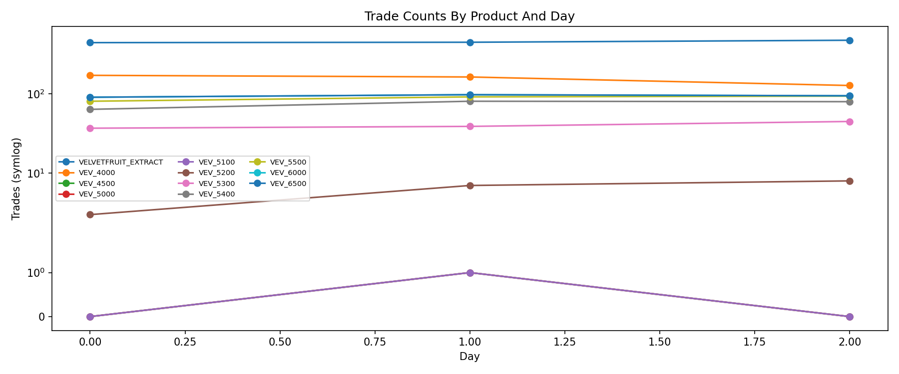

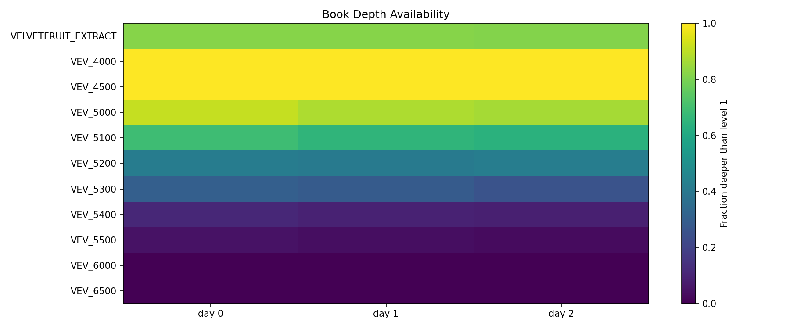

| day | product | book_snapshots | trades | timestamp_grid_gaps | trades_outside_top_book |
| --- | --- | --- | --- | --- | --- |
| 0 | VELVETFRUIT_EXTRACT | 10000 | 445 | 0 | 1 |
| 0 | VEV_4000 | 10000 | 172 | 0 | 0 |
| 0 | VEV_4500 | 10000 | 0 | 0 | 0 |
| 0 | VEV_5000 | 10000 | 0 | 0 | 0 |
| 0 | VEV_5100 | 10000 | 0 | 0 | 0 |
| 0 | VEV_5200 | 10000 | 3 | 0 | 0 |
| 0 | VEV_5300 | 10000 | 37 | 0 | 0 |
| 0 | VEV_5400 | 10000 | 64 | 0 | 0 |
| 0 | VEV_5500 | 10000 | 81 | 0 | 0 |
| 0 | VEV_6000 | 10000 | 91 | 0 | 0 |
| 0 | VEV_6500 | 10000 | 91 | 0 | 0 |
| 1 | VELVETFRUIT_EXTRACT | 10000 | 450 | 0 | 3 |
| 1 | VEV_4000 | 10000 | 164 | 0 | 0 |
| 1 | VEV_4500 | 10000 | 1 | 0 | 0 |
| 1 | VEV_5000 | 10000 | 1 | 0 | 0 |

Anomaly highlights:

- day 0 VELVETFRUIT_EXTRACT: 1 trades outside top bid/ask

- day 1 VELVETFRUIT_EXTRACT: 3 trades outside top bid/ask

- day 2 VELVETFRUIT_EXTRACT: 2 trades outside top bid/ask

**Strategy implication:** The data is usable for synchronized book-state replay; same-timestamp trade/book joins are reliable enough to study execution, but top-book outside-range flags should be treated as hidden-depth or crossed-time artifacts rather than free arbitrage by default.

## Section 2 - Velvetfruit Underlying EDA

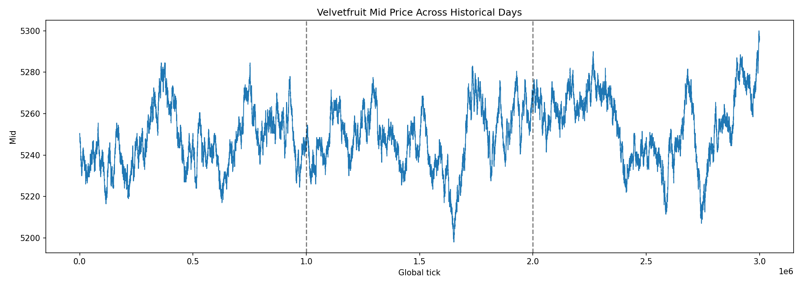

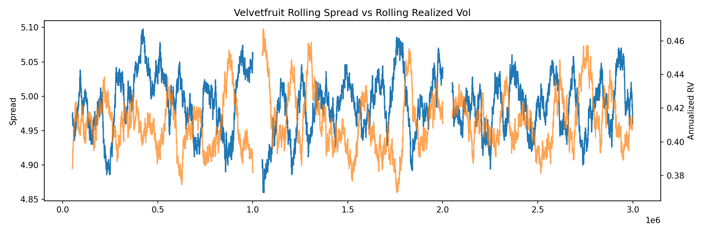

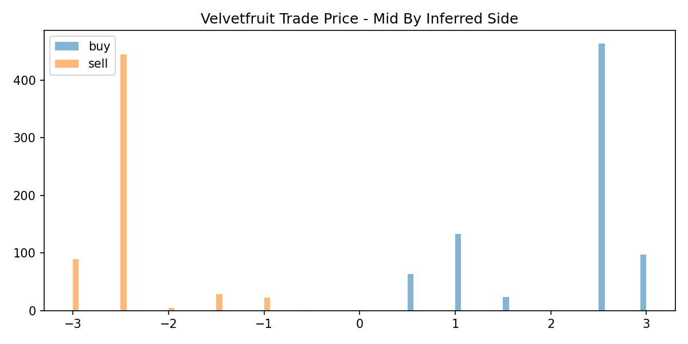

Regime classification: **trending**. ADF/KPSS/Hurst/variance-ratio diagnostics are in `tables/velvetfruit_stationarity.json`.

| day | horizon_ticks | mean | std | skew | kurtosis | jarque_bera_stat | jarque_bera_pvalue |
| --- | --- | --- | --- | --- | --- | --- | --- |
| 0 | 1 | -1.144e-07 | 0.0002136 | -0.03972 | 0.4517 | 87.65 | 9.257e-20 |
| 0 | 10 | -1.078e-06 | 0.0005858 | -0.00673 | 0.04703 | 0.996 | 0.6077 |
| 1 | 1 | 3.901e-07 | 0.0002162 | -0.0307 | 0.3246 | 45.47 | 1.335e-10 |
| 1 | 10 | 4.284e-06 | 0.0005674 | -0.0266 | -0.002138 | 1.18 | 0.5542 |
| 2 | 1 | 5.302e-07 | 0.0002166 | -0.02943 | 0.2828 | 34.77 | 2.816e-08 |
| 2 | 10 | 6.048e-06 | 0.0005749 | 0.02639 | -0.07739 | 3.652 | 0.161 |
| pooled | 1 | 2.687e-07 | 0.0002155 | -0.03316 | 0.3518 | 160.2 | 1.615e-35 |
| pooled | 10 | 3.085e-06 | 0.0005761 | -0.00242 | -0.007265 | 0.09516 | 0.9535 |

Spread summary:

| day | mean | median | mode | p95 |
| --- | --- | --- | --- | --- |
| 0 | 4.994 | 5 | 5 | 6 |
| 1 | 4.985 | 5 | 5 | 6 |
| 2 | 4.986 | 5 | 5 | 6 |

Imbalance regression coefficient is `0.0001533` with R² `0.01105`. Trades at mid fraction `0.00%`; away-from-mid fraction `100.00%`.

Flow toxicity summary:

| horizon | side | mean_forward_return | count |
| --- | --- | --- | --- |
| 100 | buy | 7.923e-05 | 781 |
| 100 | sell | -2.271e-05 | 591 |
| 500 | buy | 8.859e-05 | 781 |
| 500 | sell | 2.373e-06 | 591 |
| 1000 | buy | 7.468e-05 | 781 |
| 1000 | sell | -3.047e-05 | 591 |

**Strategy implication:** Velvetfruit is best treated as a maker-first underlying for hedging VEV voucher risk; taker flow only deserves attention when trade direction is followed by consistent forward movement because the book spread is still the primary cost gate.

## Section 3 - Individual Voucher EDA

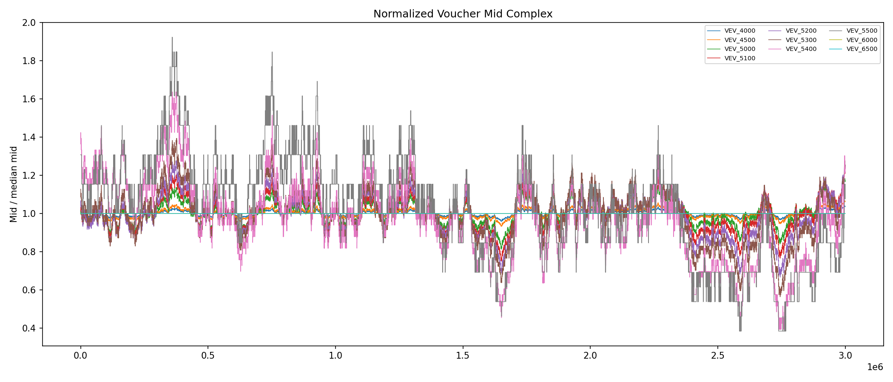

| voucher | strike | day | mean_spread | median_spread | p95_spread | mean_mid | spread_pct_mid | trades_per_1000_timestamps | mean_top_depth | fraction_timestamps_with_no_trades |
| --- | --- | --- | --- | --- | --- | --- | --- | --- | --- | --- |
| VEV_4000 | 4000 | 0 | 20.77 | 21 | 22 | 1247 | 0.01666 | 0.172 | 10.91 | 0.9828 |
| VEV_4500 | 4500 | 0 | 15.78 | 16 | 17 | 746.5 | 0.02114 | 0 | 8.923 | 1 |
| VEV_5000 | 5000 | 0 | 6.002 | 6 | 7 | 253.3 | 0.0237 | 0 | 15.38 | 1 |
| VEV_5100 | 5100 | 0 | 4.32 | 4 | 5 | 168.1 | 0.0257 | 0 | 19.18 | 1 |
| VEV_5200 | 5200 | 0 | 2.926 | 3 | 3 | 97.47 | 0.03002 | 0.003 | 22.46 | 0.9997 |
| VEV_5300 | 5300 | 0 | 2.161 | 2 | 3 | 48.89 | 0.04419 | 0.037 | 20.15 | 0.9963 |
| VEV_5400 | 5400 | 0 | 1.43 | 1 | 2 | 18.47 | 0.07742 | 0.064 | 21.65 | 0.9936 |
| VEV_5500 | 5500 | 0 | 1.181 | 1 | 2 | 8.059 | 0.1465 | 0.081 | 22.09 | 0.9919 |
| VEV_6000 | 6000 | 0 | 1 | 1 | 1 | 0.5 | 2 | 0.091 | 22.48 | 0.9909 |
| VEV_6500 | 6500 | 0 | 1 | 1 | 1 | 0.5 | 2 | 0.091 | 15.45 | 0.9909 |
| VEV_4000 | 4000 | 1 | 20.77 | 21 | 22 | 1248 | 0.01664 | 0.164 | 10.95 | 0.9836 |
| VEV_4500 | 4500 | 1 | 15.81 | 16 | 17 | 748.4 | 0.02113 | 0.001 | 8.92 | 0.9999 |
| VEV_5000 | 5000 | 1 | 6.008 | 6 | 7 | 253.3 | 0.02372 | 0.001 | 15.46 | 0.9999 |
| VEV_5100 | 5100 | 1 | 4.257 | 4 | 5 | 165 | 0.0258 | 0.001 | 19.32 | 0.9999 |
| VEV_5200 | 5200 | 1 | 2.878 | 3 | 3 | 95.13 | 0.03025 | 0.007 | 22.48 | 0.9993 |
| VEV_5300 | 5300 | 1 | 2.109 | 2 | 3 | 46.91 | 0.04495 | 0.039 | 20.23 | 0.9961 |
| VEV_5400 | 5400 | 1 | 1.386 | 1 | 2 | 15.65 | 0.08856 | 0.081 | 21.71 | 0.9919 |
| VEV_5500 | 5500 | 1 | 1.153 | 1 | 2 | 6.571 | 0.1754 | 0.092 | 22.15 | 0.9908 |
| VEV_6000 | 6000 | 1 | 1 | 1 | 1 | 0.5 | 2 | 0.098 | 22.44 | 0.9902 |
| VEV_6500 | 6500 | 1 | 1 | 1 | 1 | 0.5 | 2 | 0.098 | 15.48 | 0.9902 |

**Strategy implication:** Prefer vouchers with both non-trivial trade count and manageable spread-to-mid. Deep OTM floor-price vouchers can look cheap to sell but their 1-tick spread is enormous relative to value; dead strikes should be quoted passively or skipped.

## Section 4 - Options Cross-Voucher Analysis

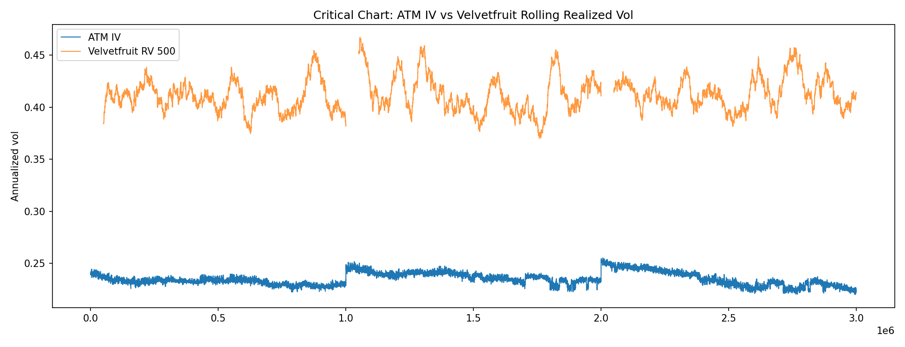

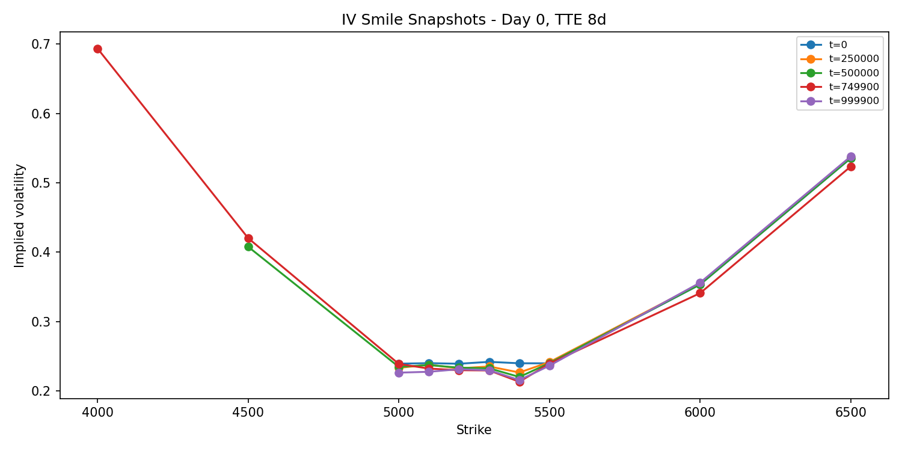

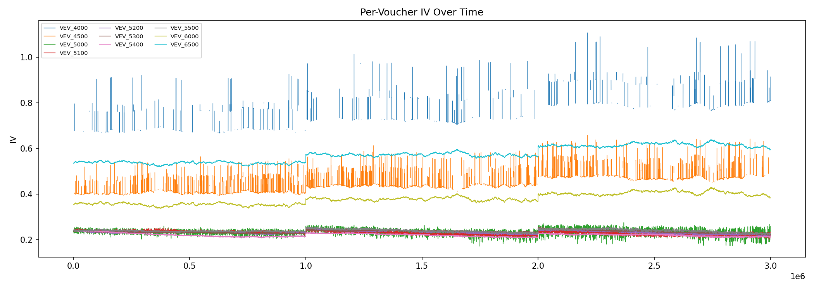

Mean ATM IV minus RV gap across historical days: **-17.77%**.

Top no-arbitrage violation groups:

| voucher | violation_count |
| --- | --- |
| VEV_4500 | 8812 |
| VEV_4000 | 2986 |
| VEV_5400,VEV_5500,VEV_6000 | 9 |
| VEV_5000 | 3 |
| VEV_5100 | 0 |

**Strategy implication:** The IV-vs-RV gap is the main option-complex signal. When IV is below RV, favor owning liquid gamma near ATM; when IV is above RV, sell premium only where spread and tail risk are acceptable. No-arb violations should be filtered for persistence and executable spread before trading.

## Section 5 - Lead-Lag Between Velvetfruit And VEV Vouchers

| voucher | best_lag | peak_correlation | residual_std | residual_autocorr_lag1 |
| --- | --- | --- | --- | --- |
| VEV_4000 | 0 | 0.5947 | 0.001358 | -0.03496 |
| VEV_4500 | 0 | 0.5976 | 0.001559 | -0.07222 |
| VEV_5000 | 0 | 0.7524 | 0.003705 | -0.1045 |
| VEV_5100 | 0 | 0.7627 | 0.00502 | -0.1025 |
| VEV_5200 | 0 | 0.7193 | 0.007128 | -0.1382 |
| VEV_5300 | 0 | 0.6123 | 0.01081 | -0.2217 |
| VEV_5400 | 0 | 0.5252 | 0.0177 | -0.2508 |
| VEV_5500 | 0 | 0.3338 | 0.02855 | -0.2425 |
| VEV_6000 |  |  | 1.243e-06 | -0.1581 |
| VEV_6500 |  |  | 8.556e-07 | -0.1583 |

**Strategy implication:** Vouchers with strong zero/near-zero lag correlation are mostly delta exposure; the useful alpha candidates are the ones with autocorrelated delta-hedged residuals and spreads small enough to enter without donating edge.

## Section 6 - Strategy Hypotheses

- Velvetfruit should be traded **maker-first, with selective taker hedges**. The classification is trending and imbalance has low explanatory power unless filtered.

- IV sits below RV on average by about **17.77%** using the ATM proxy and 500-tick annualized RV.

- Most tradeable vouchers by prints are: VEV_4000, VEV_6000, VEV_6500, VEV_5500. Effectively dead or near-dead vouchers by trade rate are: VEV_5300, VEV_5200, VEV_4500, VEV_5000, VEV_5100.

- Lowest spread-to-mid vouchers are: VEV_4000, VEV_4500, VEV_5000, VEV_5100. Highest spread-to-mid vouchers are: VEV_5500, VEV_6000, VEV_6500.

- No-arb issues most often involve: VEV_4500, VEV_4000, VEV_5400,VEV_5500,VEV_6000, VEV_5000, VEV_5100. Treat these as candidates only if they persist longer than one timestamp and beat bid/ask costs.

- Strongest lead-lag/residual candidates are: VEV_5100, VEV_5000, VEV_5200. The lag is exploitable only if peak lag is non-zero and spread-to-mid is small enough.

- Surprise to investigate before strategy: floor-price OTM vouchers can dominate apparent no-arb/IV signals because 0/1 quotes create huge percentage spreads and unstable implied vol.

## Section 7 - Fair Value Dynamics, Trade Analysis, Bot Patterns, Book Structure

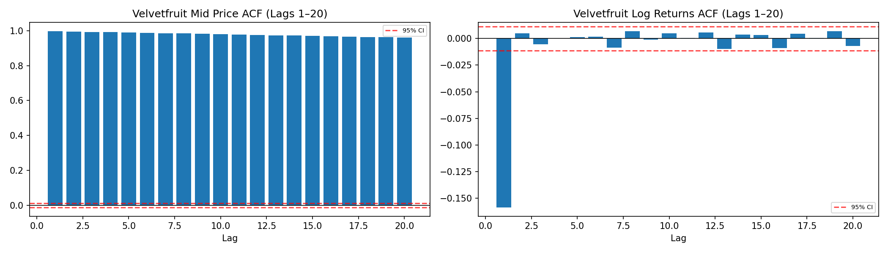

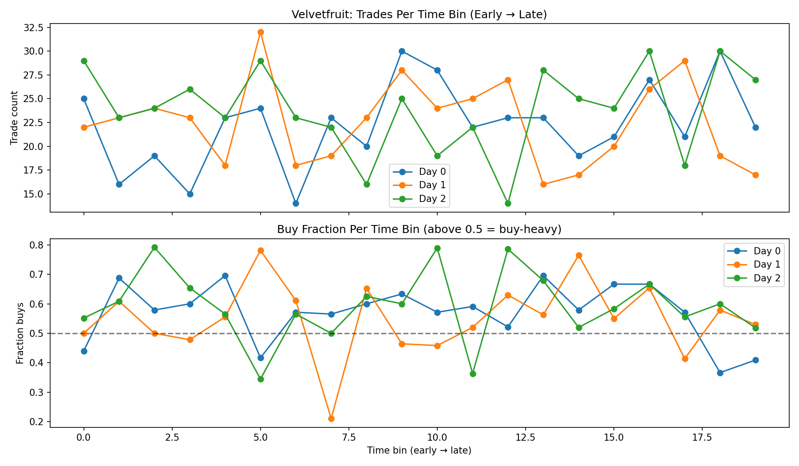

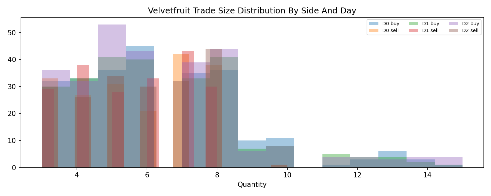

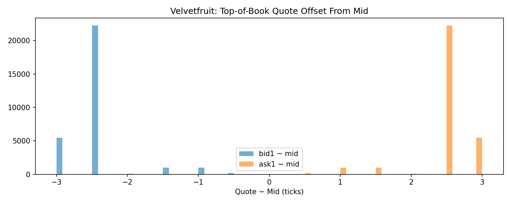

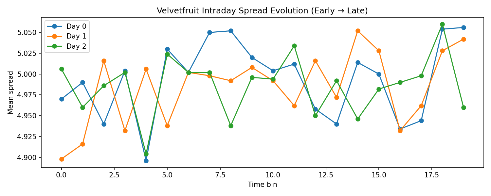

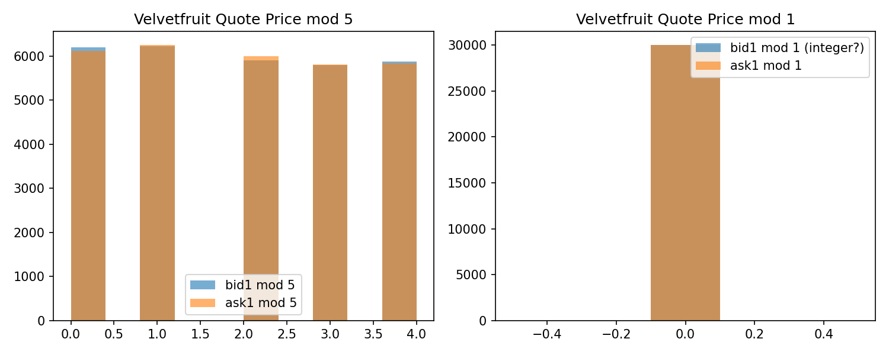

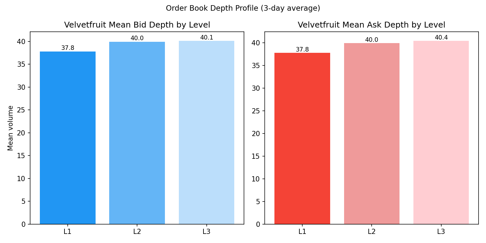

Fair value dynamics (tick-level price changes):

| day | tick_vol_abs | drift_per_tick | drift_per_day_ticks | frac_zero_change | frac_positive_change | frac_negative_change | max_up_move | max_down_move |
| --- | --- | --- | --- | --- | --- | --- | --- | --- |
| 0 | 1.121 | -0.0006001 | -6.001 | 0.2498 | 0.377 | 0.3731 | 5 | -5.5 |
| 1 | 1.135 | 0.00205 | 20.5 | 0.2443 | 0.3833 | 0.3723 | 4.5 | -4.5 |
| 2 | 1.138 | 0.0028 | 28 | 0.2459 | 0.3766 | 0.3774 | 4.5 | -5 |

Trade arrival summary:

| day | trade_count | mean_interarrival_ticks | median_interarrival_ticks | std_interarrival_ticks | trades_per_1000_ticks |
| --- | --- | --- | --- | --- | --- |
| 0 | 445 | 2227 | 1600 | 2077 | 0.445 |
| 1 | 450 | 2195 | 1700 | 2096 | 0.45 |
| 2 | 477 | 2092 | 1500 | 2071 | 0.477 |

Trade sizes by side:

| day | side | count | mean_size | median_size | std_size | max_size |
| --- | --- | --- | --- | --- | --- | --- |
| 0 | buy | 252 | 6.321 | 6 | 2.505 | 15 |
| 0 | sell | 193 | 5.679 | 6 | 1.806 | 10 |
| 1 | buy | 249 | 6.293 | 6 | 2.446 | 15 |
| 1 | sell | 201 | 5.562 | 6 | 1.681 | 8 |
| 2 | buy | 280 | 6.304 | 6 | 2.573 | 15 |
| 2 | sell | 197 | 5.736 | 6 | 1.776 | 10 |

Maker fill breakdown (underlying): trades at ask = passive sell filled; trades at bid = passive buy filled:

| day | total_trades | fills_at_ask | fills_at_bid | fills_at_mid | pct_at_ask | pct_at_bid | fill_asymmetry_buy_bias |
| --- | --- | --- | --- | --- | --- | --- | --- |
| 0 | 445 | 252 | 193 | 0 | 0.5663 | 0.4337 | 0.1326 |
| 1 | 450 | 249 | 201 | 0 | 0.5533 | 0.4467 | 0.1067 |
| 2 | 477 | 280 | 197 | 0 | 0.587 | 0.413 | 0.174 |

Taker fill cost (underlying): cost of crossing the spread:

| metric | value |
| --- | --- |
| spread_mean | 4.988 |
| spread_median | 5 |
| spread_p95 | 6 |
| taker_buy_cost_mean | 2.494 |
| taker_sell_cost_mean | 2.494 |
| l1_depth_mean | 37.83 |
| typical_buy_size_mean | 6.306 |
| depth_to_size_ratio | 5.998 |

Order book depth profile (L1/L2/L3):

| level | mean_bid_vol | mean_ask_vol | bid_ask_ratio |
| --- | --- | --- | --- |
| L1 | 37.83 | 37.8 | 1.001 |
| L2 | 39.96 | 39.96 | 0.9999 |
| L3 | 40.12 | 40.43 | 0.9925 |

Velvetfruit ACF (lags 1–5):

| lag | mid_acf | ret_acf |
| --- | --- | --- |
| 1 | 0.9972 | -0.1588 |
| 2 | 0.9953 | 0.004865 |
| 3 | 0.9933 | -0.005468 |
| 4 | 0.9914 | 0.0003303 |
| 5 | 0.9895 | 0.001465 |

Trade clustering (Poisson dispersion index — >1.5 = clustered, <0.7 = underdispersed):

| day | mean_trades_per_1000tick_bin | var_trades | dispersion_index | interpretation |
| --- | --- | --- | --- | --- |
| 0 | 0.445 | 0.4094 | 0.92 | Poisson-like |
| 1 | 0.45 | 0.3879 | 0.862 | Poisson-like |
| 2 | 0.477 | 0.4759 | 0.9978 | Poisson-like |

Velvetfruit quote price rounding fractions:

| field | frac_zero |
| --- | --- |
| bid1%1 | 1 |
| ask1%1 | 1 |
| bid1%5 | 0.2068 |
| ask1%5 | 0.2038 |

Velvetfruit quote offset from mid (bid1/ask1 − mid):

| metric | value |
| --- | --- |
| bid1-mid mean | -2.494 |
| bid1-mid median | -2.5 |
| bid1-mid std | 0.4236 |
| ask1-mid mean | 2.494 |
| ask1-mid median | 2.5 |
| ask1-mid std | 0.4236 |

Voucher bot volume and rounding summary:

| voucher | bid1_frac_integer | ask1_frac_integer | bid_vol1_mean | bid_vol1_std | ask_vol1_mean | ask_vol1_std | bid_price_change_rate |
| --- | --- | --- | --- | --- | --- | --- | --- |
| VEV_4000 | 1 | 1 | 10.92 | 2.667 | 10.92 | 2.671 | 0.6244 |
| VEV_4500 | 1 | 1 | 8.951 | 2.055 | 8.949 | 2.057 | 0.6117 |
| VEV_5000 | 1 | 1 | 15.33 | 9.126 | 15.48 | 9.224 | 0.5934 |
| VEV_5100 | 1 | 1 | 19.25 | 9.656 | 19.35 | 9.628 | 0.551 |
| VEV_5200 | 1 | 1 | 22.56 | 8.717 | 22.51 | 8.756 | 0.4489 |
| VEV_5300 | 1 | 1 | 20.28 | 6.321 | 20.24 | 6.342 | 0.2966 |
| VEV_5400 | 1 | 1 | 21.76 | 4.8 | 21.72 | 4.827 | 0.1391 |
| VEV_5500 | 1 | 1 | 22.18 | 4.17 | 22.17 | 4.152 | 0.06123 |
| VEV_6000 | 1 | 1 | 22.48 | 3.619 | 22.48 | 3.588 | 3.333e-05 |
| VEV_6500 | 1 | 1 | 15.48 | 2.731 | 15.48 | 2.688 | 3.333e-05 |

Counterparty columns populated: buyer=False, seller=False.

**Strategy implication:** Stable posted volume and consistent price rounding reveal single-bot behaviour; use offset distribution to set competitive passive quote placement. Clustered trade arrival means burst periods carry more fill risk — widen or cap size during high-activity windows.

## Section 8 - Voucher Trade Analysis (Sizes, Prices vs Fair Value, Maker/Taker)

Voucher trade sizes (active vouchers):

| voucher | strike | day | trade_count | mean_size | median_size | std_size | min_size | max_size |
| --- | --- | --- | --- | --- | --- | --- | --- | --- |
| VEV_4000 | 4000 | 0 | 172 | 2.041 | 2 | 0.7973 | 1 | 3 |
| VEV_4000 | 4000 | 1 | 164 | 2.03 | 2 | 0.8394 | 1 | 3 |
| VEV_4000 | 4000 | 2 | 128 | 2 | 2 | 0.7937 | 1 | 3 |
| VEV_4500 | 4500 | 1 | 1 | 1 | 1 |  | 1 | 1 |
| VEV_5000 | 5000 | 1 | 1 | 1 | 1 |  | 1 | 1 |
| VEV_5100 | 5100 | 1 | 1 | 1 | 1 |  | 1 | 1 |
| VEV_5200 | 5200 | 0 | 3 | 5 | 5 | 0 | 5 | 5 |
| VEV_5200 | 5200 | 1 | 7 | 3.143 | 4 | 1.464 | 1 | 5 |
| VEV_5200 | 5200 | 2 | 8 | 3.25 | 3 | 1.282 | 2 | 5 |
| VEV_5300 | 5300 | 0 | 37 | 3.459 | 4 | 1.169 | 2 | 5 |
| VEV_5300 | 5300 | 1 | 39 | 3.333 | 3 | 1.108 | 1 | 5 |
| VEV_5300 | 5300 | 2 | 45 | 3.6 | 4 | 1.176 | 2 | 5 |
| VEV_5400 | 5400 | 0 | 64 | 3.406 | 3 | 1.178 | 2 | 5 |
| VEV_5400 | 5400 | 1 | 81 | 3.531 | 4 | 1.096 | 2 | 5 |
| VEV_5400 | 5400 | 2 | 80 | 3.538 | 4 | 1.179 | 2 | 5 |

Voucher trade price vs BS fair value (mean deviation per voucher; positive = trades above BS FV):

| voucher | trade_count | mean_trade_minus_fv | std_trade_minus_fv | mean_trade_price | mean_bs_fv |
| --- | --- | --- | --- | --- | --- |
| VEV_4000 | 46 | 1.446 | 10.2 | 1247 | 1246 |
| VEV_5000 | 1 | 1 |  | 238 | 237 |
| VEV_5100 | 1 | 1 |  | 152 | 151 |
| VEV_5200 | 18 | -0.9167 | 0.3536 | 85.28 | 86.19 |
| VEV_5300 | 121 | -0.9628 | 0.1845 | 44.16 | 45.12 |
| VEV_5400 | 225 | -0.6289 | 0.2192 | 14.88 | 15.51 |
| VEV_5500 | 267 | -0.5468 | 0.1459 | 5.951 | 6.498 |
| VEV_6000 | 284 | -0.5 | 1.725e-12 | 0 | 0.5 |
| VEV_6500 | 284 | -0.5 | 6.023e-13 | 0 | 0.5 |

Voucher maker/taker fill breakdown:

| voucher | trade_count | fills_at_ask | fills_at_bid | spread_at_trade_mean | pct_at_ask | pct_at_bid |
| --- | --- | --- | --- | --- | --- | --- |
| VEV_4000 | 464 | 226 | 238 | 20.86 | 0.4871 | 0.5129 |
| VEV_4500 | 1 | 1 | 0 | 7 | 1 | 0 |
| VEV_5000 | 1 | 1 | 0 | 2 | 1 | 0 |
| VEV_5100 | 1 | 1 | 0 | 2 | 1 | 0 |
| VEV_5200 | 18 | 1 | 17 | 1.944 | 0.05556 | 0.9444 |
| VEV_5300 | 121 | 1 | 119 | 1.959 | 0.008264 | 0.9835 |
| VEV_5400 | 225 | 0 | 225 | 1.258 | 0 | 1 |
| VEV_5500 | 267 | 0 | 267 | 1.094 | 0 | 1 |
| VEV_6000 | 284 | 0 | 284 | 1 | 0 | 1 |
| VEV_6500 | 284 | 0 | 284 | 1 | 0 | 1 |

**Strategy implication:** Voucher trades above BS fair value = the market is paying a premium for the option (buy bias). Trades below FV = selling pressure. Use this alongside IV-vs-RV gap to confirm direction before quoting. Fill breakdown tells you which side of the book sees more aggressive flow — bias your passive quotes toward the heavier side.

## Section 9 - Options Deep Dive Outputs

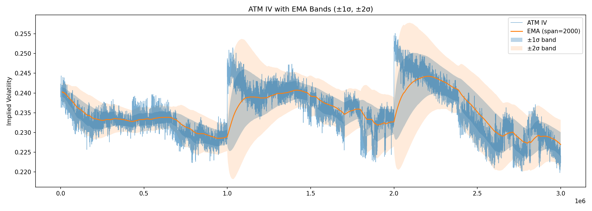

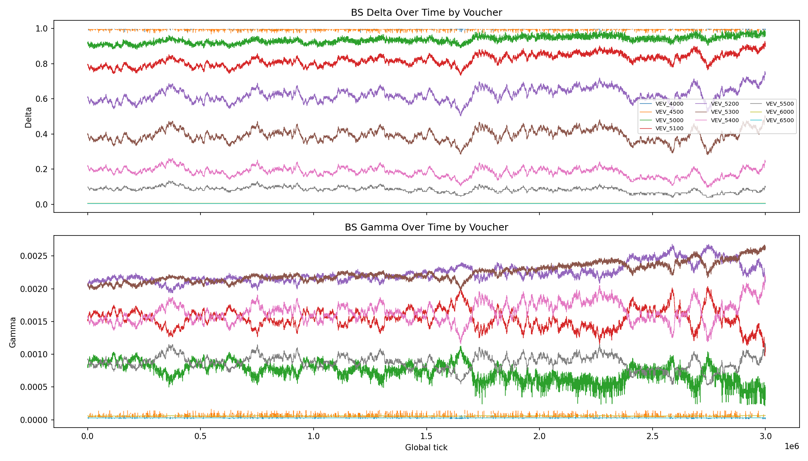

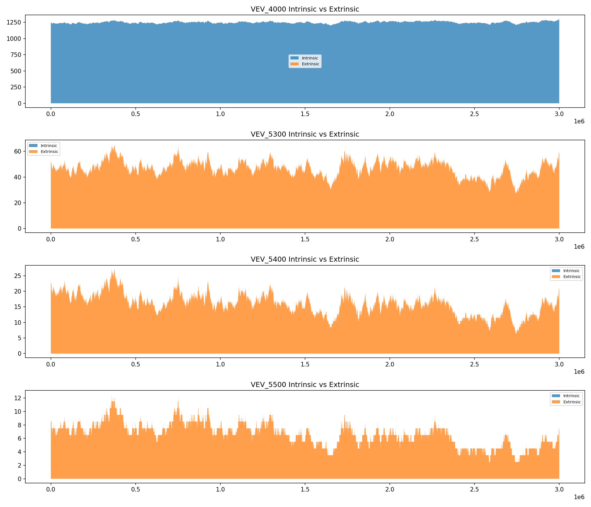

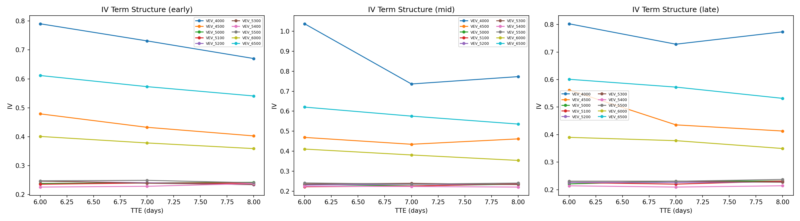

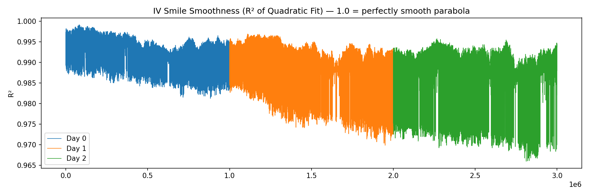

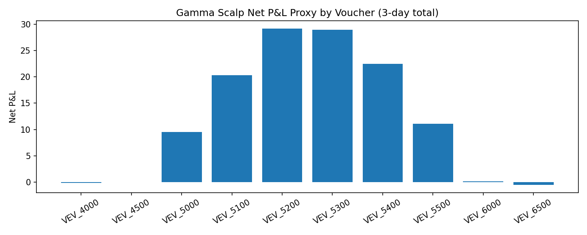

Intrinsic vs Extrinsic decomposition (means by voucher/day):

| voucher | day | option_mid | intrinsic | extrinsic |
| --- | --- | --- | --- | --- |
| VEV_4000 | 0 | 1247 | 1247 | 0.129 |
| VEV_4000 | 1 | 1248 | 1248 | 0.1358 |
| VEV_4000 | 2 | 1255 | 1255 | 0.131 |
| VEV_4500 | 0 | 746.5 | 746.5 | 0.2197 |
| VEV_4500 | 1 | 748.4 | 748.4 | 0.2245 |
| VEV_4500 | 2 | 755.4 | 755.4 | 0.2074 |
| VEV_5000 | 0 | 253.3 | 246.5 | 6.749 |
| VEV_5000 | 1 | 253.3 | 248.4 | 4.871 |
| VEV_5000 | 2 | 258.5 | 255.4 | 3.153 |
| VEV_5100 | 0 | 168.1 | 146.5 | 21.6 |
| VEV_5100 | 1 | 165 | 148.4 | 16.59 |
| VEV_5100 | 2 | 167.3 | 155.4 | 11.93 |

Gamma scalp P&L proxy (per 1 option unit, 3-day cumulative):

| voucher | total_gamma_pnl | total_theta_cost | net_gamma_scalp_pnl |
| --- | --- | --- | --- |
| VEV_4000 | 0.1037 | -0.2246 | -0.1209 |
| VEV_4500 | 0.406 | -0.3806 | 0.0254 |
| VEV_5000 | 13.99 | -4.49 | 9.501 |
| VEV_5100 | 29.58 | -9.293 | 20.29 |
| VEV_5200 | 42.97 | -13.8 | 29.18 |
| VEV_5300 | 43.07 | -14.15 | 28.92 |
| VEV_5400 | 31.61 | -9.128 | 22.48 |
| VEV_5500 | 16.79 | -5.716 | 11.07 |
| VEV_6000 | 1.148 | -0.9798 | 0.1685 |
| VEV_6500 | 0.5429 | -1.064 | -0.5212 |

Mean IV smile smoothness (quadratic R²) by day: {0: 0.992713900469438, 1: 0.9890723569063495, 2: 0.9871240701185641}. Values near 1.0 = well-behaved parabolic smile; lower values signal distortions.

**Strategy implication:** Use EMA bands to identify when IV is elevated (sell premium) or depressed (buy gamma). Delta/gamma timeseries directly informs hedge ratios and position sizing. Gamma scalp P&L proxy shows which strikes generate the most delta-hedging edge across the 3-day window.
