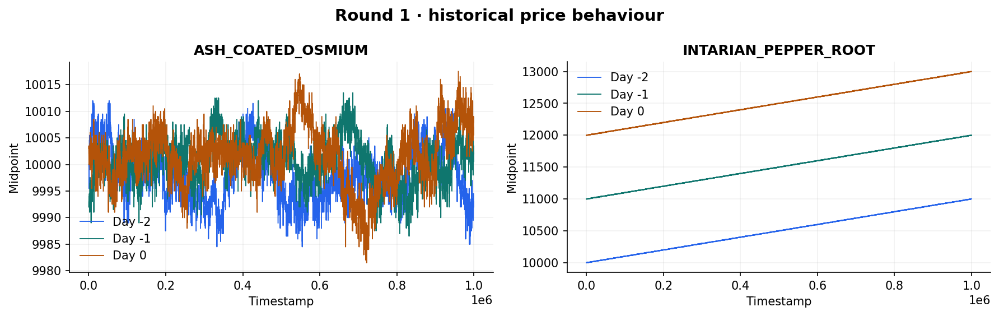
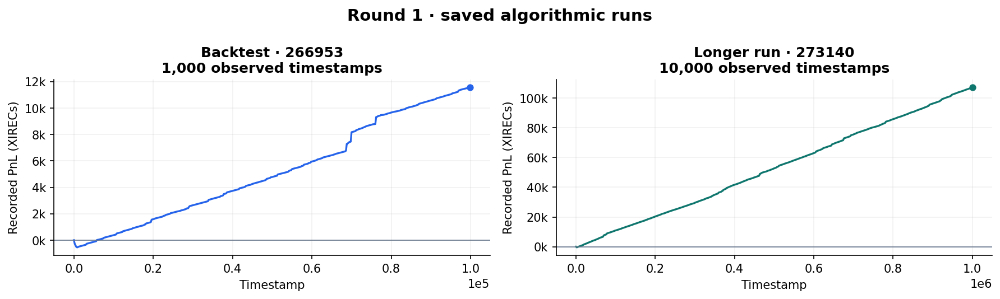

# Round 1 · Market making and directional carry

[Overview](../../README.md) · [Next: round 2](../round2/README.md)

Explore the historical tape with the [dashboard](../../docs/dashboards.md).

Round 1 traded `ASH_COATED_OSMIUM` and `INTARIAN_PEPPER_ROOT`, each with a position limit of 80. The two products led to different approaches: an inventory-adjusted market maker for Osmium and a long position in Pepper to capture its observed upward drift.

Our overall standing after this round was **77th globally**. The precise official algorithmic/manual score breakdown is still to be added.

## Algorithmic trading

### Osmium: estimate fair value, then manage inventory

The algorithm updates an exponential moving average with weight 0.2. Its short-term fair value moves halfway from the current midpoint toward that average:

```text
fair = mid + 0.5 × (EMA − mid)
reservation price = fair − position × 0.05 × 3.72
```

The inventory term lowers the reservation price when long and raises it when short. The strategy takes a best quote when it offers at least 1.5 ticks of edge. Otherwise it posts passive quotes with a 3-tick target edge, improving the existing best quote by one tick where possible.

When one side of the book is empty, the algorithm estimates the midpoint from the available side and an assumed half-spread. It then posts a quote 100 ticks away on the empty side, attempting to capture unusually permissive taker flow.

### Pepper: carry the drift and protect against a reversal

The historical research measured roughly 1,000 price points of upward drift per day. The strategy therefore builds toward a long position of 80, taking available best asks in visible-sized chunks.

A fall of more than 50 points from the opening estimate triggers an attempt to flatten. If the ask side is empty while the strategy is long, it offers that inventory at an estimated midpoint plus 100. The normal rebuild logic is skipped on that tick.



*Two-sided book midpoints from the included daily CSVs; empty-book observations appear as gaps. The products' different price behaviour explains the different inventory policies.*

The [algorithm](algo/trader.py) is snapshot `266953.py` from the final-submission folder. The 10,000-step run used the same code.

## Manual trading

Our notes identify `DRYLAND_FLAX` and `EMBER_MUSHROOM` as manual products and mention auction research. The auction reasoning, actual orders, and official result still need to be added.

## Recorded results

| Export | Run ID | Recorded PnL |
| --- | --- | ---: |
| 1,000-step backtest | [266953](results/266953.json) | 11,565.84 |
| 10,000-step run | [273140](results/273140.json) | 107,280.53 |



*These are separate saved runs. Their different horizons prevent a direct like-for-like comparison; neither value is presented as the official round score.*

## Research and reproduction

The [market analysis](analysis/market_analysis.py) uses the [historical CSVs](../../data/README.md). Run it from the repository root:

```bash
python rounds/round1/analysis/market_analysis.py --output-dir outputs/round1
python -m prosperity3bt rounds/round1/algo/trader.py 1 --data data --no-out --no-progress
```
