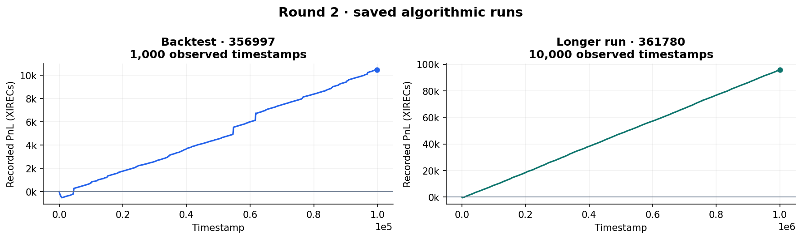

# Round 2 · Refinement and resource allocation

[Overview](../../README.md) · [Previous: round 1](../round1/README.md) · [Next: round 3](../round3/README.md)

Explore the historical tape with the [dashboard](../../docs/dashboards.md).

Round 2 continued with Osmium and Pepper. The strategy carries forward the round 1 market-making and directional-carry design, while adding an explicit market-access bid. The manual work considered how to divide an investment budget between research, sales, and speed.

## Algorithmic trading

The [algorithm](algo/trader.py) is final-submission snapshot `356997.py`; the longer run used the same code. Its inherited source header still says round 1.

The Osmium reservation-price model, Pepper long target, reversal guard, and empty-side quotes follow the [round 1 approach](../round1/README.md#algorithmic-trading). The snapshot returns **102** from `Trader.bid()`.

The research notes describe market access as a blind bidding decision with a fee and a changed quote feed. They also record uncertainty about whether extra quotes would improve our actual fills. The replay engine does not reproduce this auction.

The [research notebook](analysis/market_analysis.ipynb) examines stationarity, spreads, order-book features, trade flow, and model candidates. These experiments cover a broader set of models than the strategy snapshot uses.

## Manual trading

The [allocation stress test](manual/pnl_stresstest.py) uses a 50,000 budget and evaluates a research/sales/speed split of **18 / 58 / 24** under several assumptions about a competitive multiplier `M`:

```text
research output = 200000 × log(1 + r) / log(101)
sales factor = 7 × s / 100
cost = (r + s + p) / 100 × 50000
model PnL = research output × sales factor × M − cost
```

Here `r`, `s`, and `p` use percentage-point units, as in the original script. Speed enters the cost directly; the script supplies `M` externally rather than modelling how speed or other teams determine it. The 18 / 58 / 24 allocation is an evaluated example, whose final submission status is unconfirmed.

## Recorded results

| Export | Run ID | Recorded PnL |
| --- | --- | ---: |
| 1,000-step backtest | [356997](results/356997.json) | 10,469.53 |
| 10,000-step run | [361780](results/361780.json) | 95,843.08 |



*Separate saved runs with different horizons. These values are not the official leaderboard or manual-allocation scores.*

## Reproduction

```bash
python rounds/round2/manual/pnl_stresstest.py
python -m prosperity3bt rounds/round2/algo/trader.py 2 --data data --no-out --no-progress
```

The notebook requires the optional research dependencies described in the [reproduction guide](../../docs/reproducing.md).
