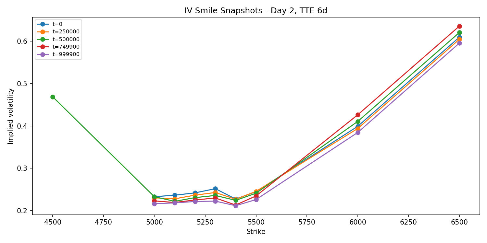
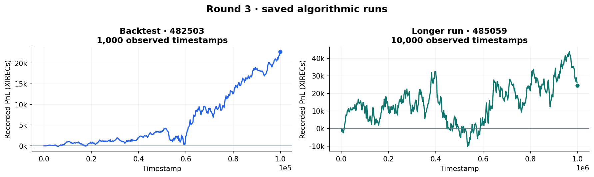
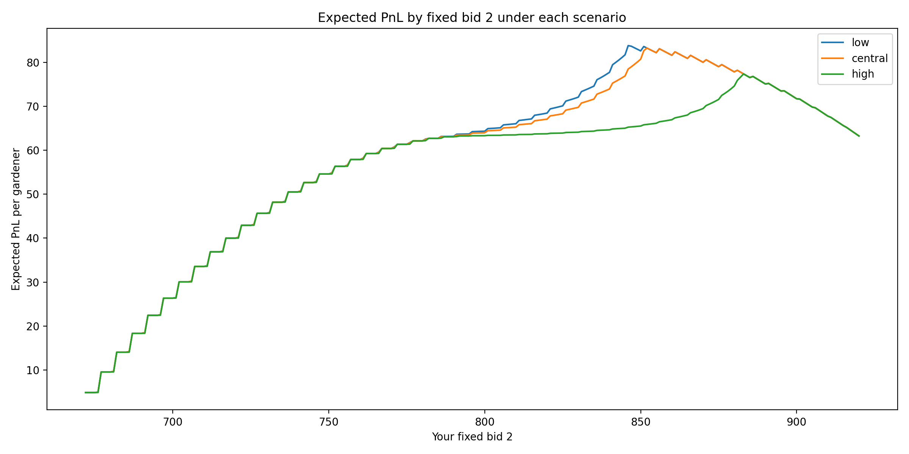

# Round 3 · Options, bidding, and model risk

[Overview](../../README.md) · [Previous: round 2](../round2/README.md) · [Next: round 4](../round4/README.md)

Explore the historical tape with the [dashboard](../../docs/dashboards.md).

Phase 2 introduced `HYDROGEL_PACK`, `VELVETFRUIT_EXTRACT`, and ten `VEV_*` call vouchers with strikes from 4,000 to 6,500. The spot position limits were 200; the voucher limits were 300 each. The manual challenge asked for two bids to buy Bio-Pods from gardeners with different reserve prices.

## Algorithmic trading

### Hydrogel: signals, target positions, and execution

The strategy combines rolling z-scores, local highs/lows, and short-term momentum to choose a Hydrogel target. Stronger signals allow larger active slices, while passive orders move inventory toward a softer target. State is carried between ticks in `traderData`.

The important implementation detail is that the anchor comes from recent prices. A negative z-score means cheap relative to that rolling window, which can differ substantially from cheap relative to a stable long-run value.

### Voucher pricing

The options research studies implied volatility, strike relationships, liquidity, and the difference between implied and realised volatility. Historical expiry assumptions use 8, 7, and 6 days for the three supplied datasets; the notes discuss a 5-day live horizon. Annualisation conventions and expiry assumptions must be consistent when interpreting the charts.

*Implied-volatility smile from the options research.*

The [algorithm](algo/trader.py), final-labelled snapshot `482503.py`, uses calibrated anchors, exponential averages, regression relationships, and approximate deltas. It does **not** continuously recompute Black–Scholes fair values for its main voucher quotes. The longer run used the same code.

The postmortem identifies a problem with this calibration: a large weight on an old anchor could keep the strategy buying vouchers even after the underlying moved and the options' fair values changed.

## What the recorded runs revealed

| Product | 1,000-step backtest | 10,000-step run |
| --- | ---: | ---: |
| Hydrogel | 14,896 | 6,837 |
| VEV_5000 | 1,985 | 9,379 |
| VEV_5100 | 2,223 | 6,048 |
| VEV_5300 | 626 | −1,256 |
| VEV_5400 | 144 | −704 |
| **Total, all products** | **22,726** | **24,505** |

*Rounded product-level values from the saved runs, which have different horizons and market paths.*

The postmortem raises three useful concerns. Hydrogel's rolling reference could generate a large position when price was not cheap relative to the longer-run anchor. Voucher fair values could lag the underlying because of their fixed calibration. Gains in deep in-the-money vouchers could then reflect directional underlying exposure rather than a stable market-making edge.

These are diagnoses supported by the code and recorded paths. Proposed fixes were not validated by a saved counterfactual run, so the write-up does not claim a specific recoverable profit.

## Manual trading

The [bid model](manual/bid_model.py) assumes reserve prices are uniformly distributed on `{670, 675, …, 920}`, a resale value of 920, and strict `bid > reserve` execution. Bid 1 takes precedence. Bid 2 receives an additional cubic penalty when it does not exceed the competitor mean.

The model separates the mechanical payoff calculation from a behavioural forecast of other teams. Low, central, and high scenarios generate different distributions for the competitor mean; it optimises bid pairs under each and compares regret across scenarios.

*Model output under assumed competitor scenarios.*

The central scenario recommended **761 / 852**, with model expected PnL of about **83.24 per gardener**. A scenario-weighted candidate was **766 / 856**. Draft personal notes also mention 761 with second bids around 853–861. The exact submitted pair and official result still need confirmation.

See the [recorded scenario summary](manual/recorded/r3_scenario_summary.csv), [robust candidate table](manual/recorded/r3_robust_candidate_bids.csv), and [original recommendations](manual/recorded/r3_recommendations.txt).

## Reproduction

The recorded runs are [482503](results/482503.json) and [485059](results/485059.json). The [options analysis](analysis/options_analysis.py) and bid model are included for further investigation; see the [reproduction guide](../../docs/reproducing.md) for commands and assumptions.
