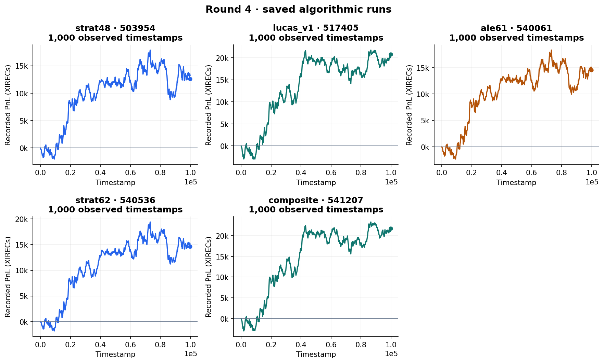
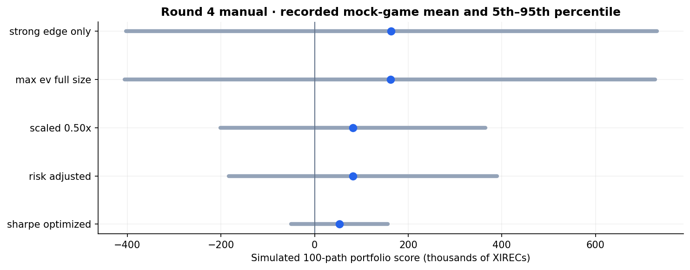

# Round 4 · Counterparty information and derivatives portfolios

[Overview](../../README.md) · [Previous: round 3](../round3/README.md) · [Next: round 5](../round5/README.md)

Round 4 continued with the phase 2 spot products and vouchers, and exposed counterparty identities in market trades. The manual challenge traded Aether Crystal and a portfolio of vanilla and exotic derivatives.

## Algorithmic trading

### Study who is on the other side

The research used targeted probes, signed forward price changes, and counterparty networks to distinguish informed flow from weaker liquidity. The strongest recorded findings were that Mark 14 was adverse to our Hydrogel/VEV_4000 quotes, Mark 01 bought voucher exposure, and Mark 38 was more favourable to trade against in the tested contexts.

The analysis separated trades with our own strategy from public player-to-player trades. Multiple tests replayed the same day, so public events were deduplicated before calculating the [market-player metrics](analysis/recorded/market_unique_player_profile_metrics.csv).

Counterparty profiles remain conditional on the products, days, and quotes tested. A profitable markout in a probe is not a guarantee of a profitable production strategy.

### Use narrow guards, then measure lost fills

The experiments compared soft quote adjustments with harder blocking. Broad protection could remove toxic exposure while also starving the voucher engine of fills. The narrower `strat48` variant applied hard protection to Hydrogel and softer adjustments elsewhere.

Selected strategy iterations:

| Candidate | Recorded test | Recorded PnL | Design |
| --- | --- | ---: | --- |
| [strat48](algo/strat48.py) | [503954](results/503954.json) | 12,604.75 | Narrow hard guards and softer voucher adjustments |
| [Lucas v1](algo/lucas_v1.py) | [517405](results/517405.json) | 20,804.00 | A later counterparty-aware combined candidate |
| [ale61](algo/ale61.py) | [540061](results/540061.json) | 14,508.41 | A later iteration with product-specific guards and liquidity budgets |
| [strat62](algo/strat62.py) | [540536](results/540536.json) | 14,613.28 | A further guarded variant with a semi-fixed Hydrogel anchor |
| [Product composite](algo/composite.py) | [541207](results/541207.json) | 21,709.00 | Separate Hydrogel and voucher engines with isolated product state |

Later iterations also examined a misleading cashflow breaker: building a long position spends cash before the inventory is sold, so a cashflow threshold could shut down otherwise useful trading. The `ale61` and `strat62` variants instead use liquidity budgets and late-session/portfolio risk controls. The composite keeps Hydrogel and the broader voucher engine separate, including their persisted state. These saved tests do not establish out-of-sample robustness despite labels in the original filenames.

*Saved candidate tests, not a controlled comparison or the official round score. The final submitted version has not yet been identified.*

The [market-profile script](analysis/market_profile.py) studies the historical tape; the [log-profile script](analysis/player_profile.py) studies probe runs. The saved tables cover [individual player behaviour](analysis/recorded/market_unique_player_profile_metrics.csv), [product-specific pairs](analysis/recorded/market_unique_pair_product_metrics.csv), [counterparty networks](analysis/recorded/market_unique_network_edges.csv), and [fills against our strategy](analysis/recorded/submission_counterparty_summary.csv). The [probe summary](analysis/recorded/bot_run_summary.csv) records which pairs and products each test targeted; the [annotated mapping](analysis/recorded/counterparties_product_level_mapping.csv) and [preferences](analysis/recorded/counterparties_types_and_preferences.csv) contain the inferred roles.

## Manual trading

### Price the contracts on the simulation grid

The [Aether model](manual/aether_model.py) uses an initial spot of 50, annual volatility of 251%, zero risk-neutral drift, 252 trading days per year, and four simulation steps per trading day. Two-week and three-week maturities correspond to 40 and 60 steps. Contract size is 3,000.

The model simulates correlated payoffs for the underlying, calls, puts, a chooser, a binary put, and a knock-out put. Barrier monitoring happens on the discrete grid. Expected payoffs are compared with executable bid/ask prices, and candidate orders respect the transcribed volume limits.

The [pricing table](manual/recorded/aether_output_prices.csv) identified positive model edges in buying the knock-out put and two-week at-the-money options, and selling the chooser and binary put.

### Optimise the portfolio, not each contract in isolation

The scoring model averages 100 simulated paths. Shared exposure creates covariance between contracts, so the script compares full-size expected-value trades with scaled, filtered, and Sharpe-searched portfolios.

*Means and 5th–95th percentile score intervals from the recorded mock games. These are simulated portfolio scores, not official manual results.*

The full-size expected-value portfolio had a mock mean around 163,000 and standard deviation around 345,000; the Sharpe-searched portfolio had a mean around 53,000 and standard deviation around 63,000. The smaller dispersion came with a lower expected payoff. This was a heuristic portfolio search.

See the [portfolio comparison](manual/recorded/aether_output_portfolio_comparison.csv) and the orders for [full-size expected value](manual/recorded/aether_output_max_ev_full_size_trades.csv), [half size](manual/recorded/aether_output_scaled_0.50x_trades.csv), [risk adjusted](manual/recorded/aether_output_risk_adjusted_trades.csv), and [Sharpe searched](manual/recorded/aether_output_sharpe_optimized_trades.csv). The recorded `strong_edge_only` portfolio used the same orders as `max_ev_full_size`; its different mock scores come from separate simulation samples. The [optimizer diagnostics](manual/recorded/aether_output_sharpe_optimizer_diagnostics.csv) record its volume choices. Which portfolio the team submitted and its official score remain to be added.

## Reproduction

Start with the small-run Aether command in [running the code](../../docs/reproducing.md) before a full simulation. The default run is substantially larger. Exact commands and seeds for the saved outputs still need to be added.
